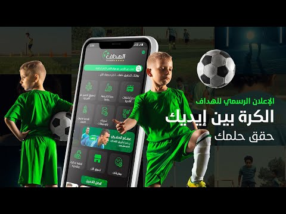
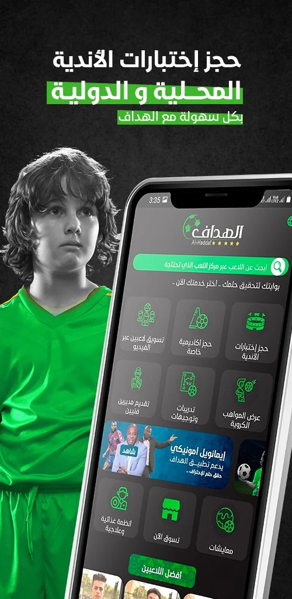
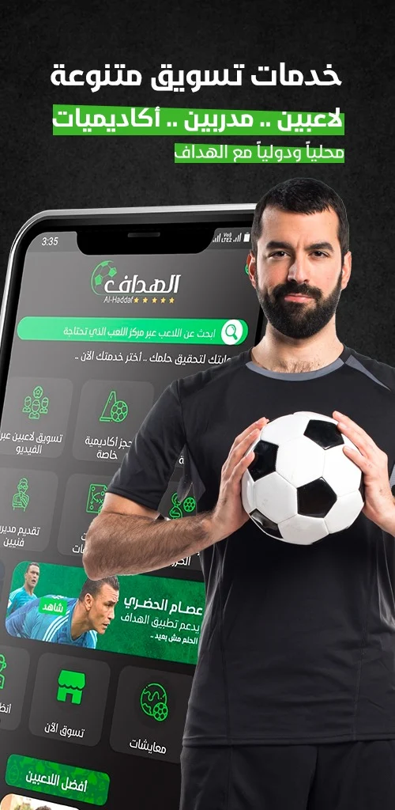
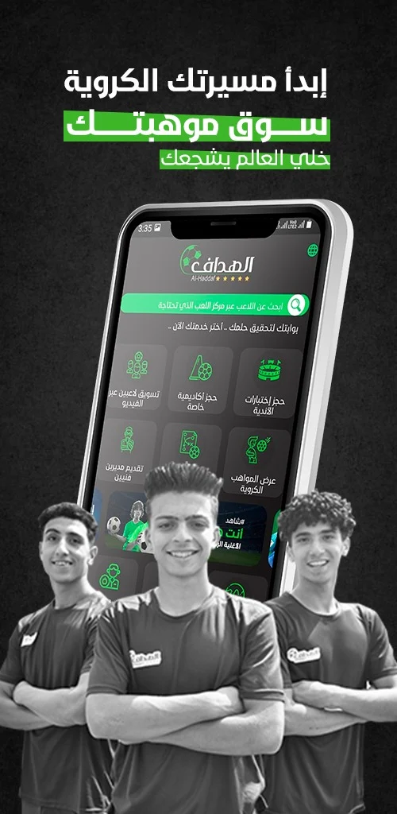
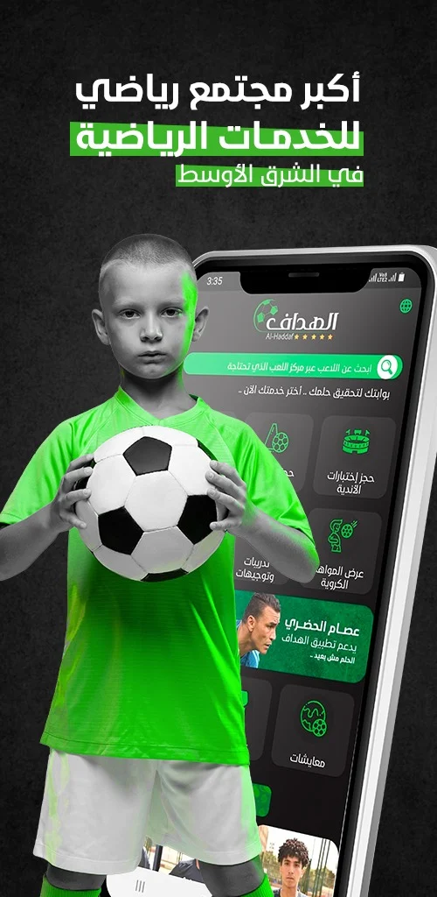

# Al-haddafApp

Al-Hadaf application works to provide multiple services in the sports field, as it provides the opportunity to market players around the world by providing video clips or booking tests for clubs and academies locally and internationally. It also provides the opportunity to market coaches and workers in sports sectors around the world.
Al-Hadaf application is considered a major product of Al-Hadaf Foundation and the holder of the first property rights around the world. Al-Hadaf application is also the locally approved one for clubs and for marketing, in addition to being internationally accredited in many countries of the world.
## Installation
<a href="https://play.google.com/store/apps/details?id=com.alhaddafcommunity.co&hl=ar&gl=US"></img></a>

[//]: # (https://play.google.com/intl/en_us/badges/images/generic/en-play-badge.png)

## ScreenShots
  

## Technologies Used

- **Flutter:** The mobile app is developed using the Flutter framework for cross-platform compatibility.
- **Firebase:** The backend is powered by Firebase for real-time database, authentication, and cloud functions.
- **Desktop App:** The admin panel is designed as a desktop application, enhancing the user experience.

## Contributors ✨

<table>
  <tr>
    <td align="center"><a href="https://github.com/HassanSayedHassan"> <b>Hassan Sayed</b></a> <a  title="Code">💻</a></td>
  </tr>
</table>

